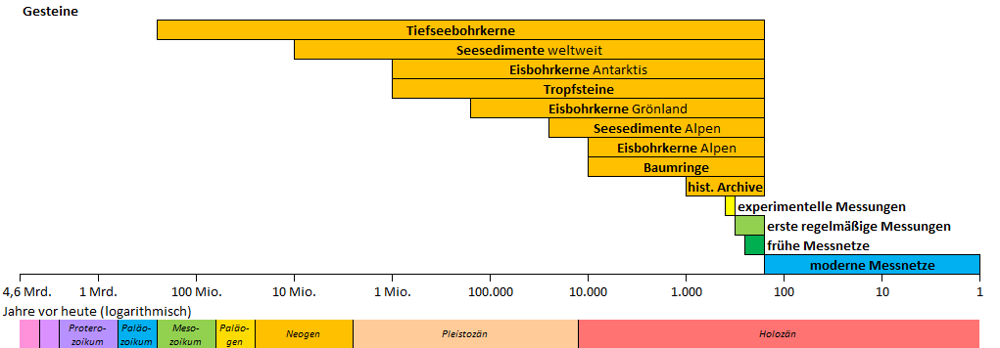
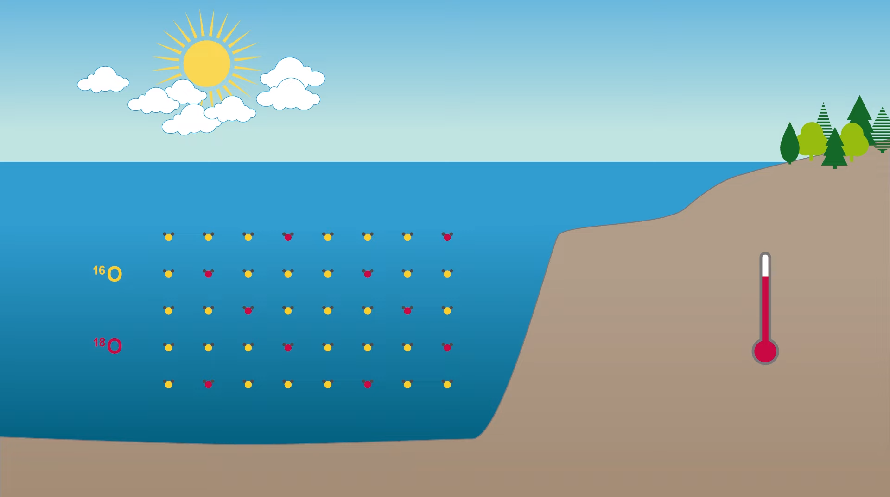
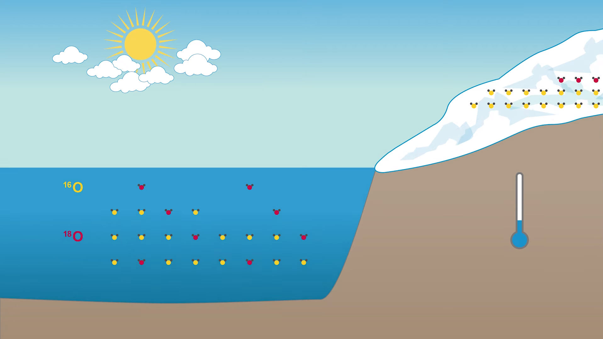
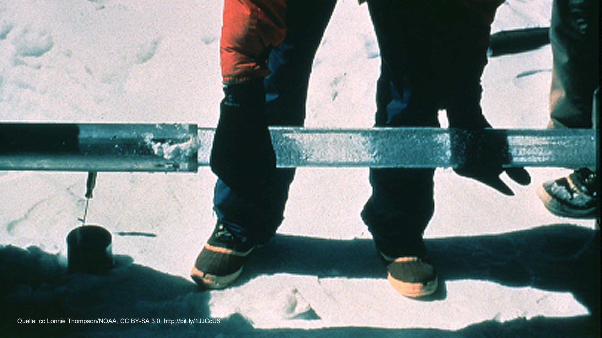
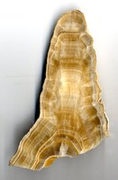

# Einleitung
%% Ideen %%
Denkt ihr, dass der Klimawandel ausschließlich vom Menschen verursacht wurde? %% Problem → wir geben selbst im Vortrag keine Antwort auf diese Leitfrage %%

# Hauptteil

## Methoden zur Rekonstruktion von Palaoklima

Die Aufgabe der Paläoklimatologie besteht darin, anhand von Messungen, Analysen sowie Datenreihen aus sogenannten Klimaarchiven die klimatischen Verhältnisse der erdgeschichtlichen Vergangenheit in Form einer Klimageschichte zu rekonstruieren und die Mechanismen von Klimawandel-Ereignissen in den verschiedenen Erdzeitaltern beziehungsweise historischen Epochen zu entschlüsseln.^[https://www.zamg.ac.at/cms/de/klima/informationsportal-klimawandel/klimaforschung/klimarekonstruktion]

### Was ist Palaoklima?

Die Paläoklimatologie ist die Untersuchung von Klimata, für die keine direkten Messungen vorgenommen wurden. Da die instrumentellen Aufzeichnungen nur einen winzigen Teil der Erdgeschichte abdecken, ist die Rekonstruktion des früheren Klimas wichtig, um die natürlichen Schwankungen und die Entwicklung des heutigen Klimas zu verstehen.^[https://en.wikipedia.org/wiki/Paleoclimatology]

### Proxydaten

Ein Klimaproxy ist ein indirekter Anzeiger des Klimas, der in natürlichen Archiven wie Baumringen, Stalagmiten, Eisbohrkernen, Korallen, See- oder Ozeansedimenten, Pollen oder menschlichen Archiven wie historischen Aufzeichnungen oder Tagebüchern aufgezeichnet wurde.^[https://de.wikipedia.org/wiki/Proxy_(Klimaforschung)]

#### Seesedimente

|                                                                                         |                                                      |
| -------------------------------------------------------------------------------------------------------------------------------------- | --------------------------------------------------------------------------------------------------- |
| Organismen leben an der Oberfläche, sterben ab und bilden am Boden Sedimente. Durch den Druck grenzen sich die einzelnen Sedimente ab. | Durch die Eisdecke senkt sich der Meeresspiegel ab und die Organismen reagieren auf diese Änderung. |

Auf dem Grund stehender Gewässer sammeln sich Partikel aus dem Wasser und der Umgebung an. Durch diese kontinuierliche Ablagerung entstehen im Laufe von Jahrtausenden mehrere Meter dicke, schlammige Schichten. Diese Seesedimente stellen im Idealfall lückenlose Klimakalender dar, die ähnlich [Baumringen](https://www.zamg.ac.at/cms/de/klima/informationsportal-klimawandel/klimaforschung/klimarekonstruktion/baumringe) Schicht für Schicht die Umweltbedingungen der Vergangenheit gespeichert haben.

Ein Großteil der heute existierenden Seen wurde am Ende des [Pleistozäns](https://www.zamg.ac.at/cms/de/klima/informationsportal-klimawandel/klimavergangenheit/palaeoklima/1-mio.-jahre) durch Gletscheraktivitäten gebildet. Das macht Seen zu relativ jungen Systemen. Seesedimente enthalten eine große Vielfalt an Informationen, welche die Umweltbedingungen zur Zeit ihrer Ablagerung reflektieren – und zwar sowohl die Vorgänge im Einzugsgebiet als auch im See selbst.

#### Tiefseebohrkerne

|  |  |
| ------------------------- | ------------------------- |

Wasser enthält sowohl die Sauerstoffisotope des leichten $^{16}O$ als auch des schwereren $^{18}O$. Wenn Eis eingefroren wird, wird allerdings vorallem leichtes $^{16}O$ eingefroren. Dadurch wird im Umkehrschluss der Anteil von $^{18}O$ im Ozean höher.

#### Eisbohrkerne

Luftblasen enthalten fossile Luft. Aus der Luft kann man den $CO^2$ Gehalt bestimmen.

#### Tropfsteine

Ein weiteres indirektes Klimaarchiv sind Tropfsteine, deren Ausprägungen in Form von Stalagmiten und Stalaktiten in Höhlen nahezu aller Regionen der Welt zu finden sind. Die Sauerstoffisotopen im Kalk dieser Tropfsteine, die Dicke der Wachstumslagen und Konzentrationen von Spurenelementen speichern klimarelevante Daten und ermöglichen mit geochemischen Analysemethoden Rückschlüsse auf vergangene Temperatur- und Niederschlagsverhältnisse.

### Datenanalyse

CO2-Gehalt und Eisvolumen sind bisher ungefähr indirekt proportional zueinander. In der Moderne ändert sich dies allerdings durch den Menschen. Mehr hierzu im [Holozänen Klimawandel](#Holozänen%20Klimawandel).

### Ableitung zur Rekonstruktion

1. Es gab regelmäßige Eiszeitzyklen
2. Warmzeiten haben höheren CO2-Gehalt in der Atmosphäre
3. Natürliche CO2-Schwankungen sind deutlich kleiner als heutige Konzentrationen

## Holozänen Klimawandel

Das Holozän ist die seit mehr als 11 000 Jahren andauernde warmzeitliche Epoche des Eiszeitalters, der die letzte Kaltzeit (Würm- oder Weichselkaltzeit) voranging. Es umfasst damit auch die Klimaänderungen der letzten 1000 Jahre und das Klima im 20. Jahrhundert.

### Klimaverlauf und natürliche Klimaschwankungen

### Klimaverlauf der letzten Jahre

## Einfluss auf den Menschen

[[]]

### Kleine Eiszeit

1. War eine Natürliche Kaltzeit nach den warmen Temperaturen des Mittelalters 1450-1850 bis zur Zeit des Imperialismus ​
2. Beischreibt eine Zeit der Kriege und des Hungers in Europa, aber auch der Weiterentwicklung und Anpassung
3. Sie endet mit dem Jahr ohne Sommer 1816 und der Irischen Hungersnot 1846-1850, beide ausgelöst durch einen Vulkanausbruch in Indonesien​

### Römische Wärmephase

1. Darunter fallen auch die Hochkulturen der Griechen, Phönizier, Perser und die letzten Ägyptischen Pharaonen​
2. War eine Blütezeit für Kunst und Philosophie ​
3. Allerdings auch für Feldzüge und Eroberungen (Alexander der Große, Cäsar oder Xerxes)

# Schluss

- Handout vergleichen
- Quellen kurz zeigen
- „Habt ihr noch Fragen?“