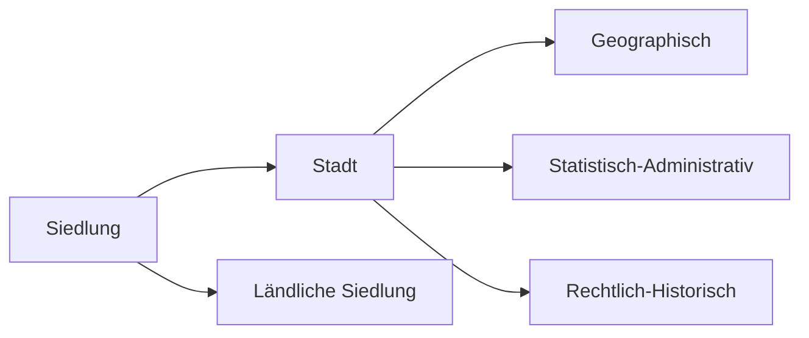

# Globale Disparität und Verflechtungen

## Indikatoren zur Messung von Länderunterschieden

### Ökonomische Indikatoren

#### Bruttoinlandsprodukt

Das Bruttoinlandsprodukt ist der Gesamtwert aller Güter, Waren & Dienstleistungen, die im Laufe eines Jahres innerhalb einer Landesgrenze einer Volkswirtschaft hergestellt werden.

| Stärken                                        | Schwächen                          |
| ---------------------------------------------- | ---------------------------------- |
| Unterscheidung Industrie- & Entwicklungsländer | Berücksichtigt Einwohnerzahl nicht |
| Einfach messbar                                | Kaufkraft im jeweiligen Land       |
|                                                | Informelle Wirtschaft/Sektor       |
|                                                | Vermögensverteilung                |

### GINI-Koeffizienten

Der Gini-Koeffizient oder auch Gini-Index ist ein statistisches Maß für die Ungleichverteilungen in einer Gruppe. Er wird mit einem Wert zwischen 0 und 1 bemessen.

- Gleiche Verteilung: 0
- Ungleiche Verteilung: 1

### Soziale Indikatoren

-  materiell
	- medizinische Versorgung
	- Nahrung, Kleidung, Trinkwasser
- immateriell
	- Bildung
	- Arbeit
	- Selbstbestimmung

### Human-Development-Index

Der Human Development Index der Vereinten Nationen ist ein Indikator für Staaten, der auch als Wohlstandsindikator bezeichnet wird. Der HDI wird seit 1990 im jährlich erscheinenden Bericht über die menschliche Entwicklung des Entwicklungsprogramms der Vereinten Nationen (UNDP) veröffentlicht.

## Länder im Vergleich

Entwicklungsstand und Wohlstand sind abhängig davon, welche historischen "Startvorteile" eine Land gegenüber anderen Ländern hatte und wie früh es dann industrialisiert wurde und durch den Einsatz von Maschinen, die durch fossile Brennstoffe wie Kohle und Erdöl betrieben wurden, seine Produktivität und damit sein BIP steigern konnte.

### Entwicklungstheorien

#### Modernisierungstheorie

- Das Grundinteresse der Modernisierungstheorie konzentriert sich auf die Frage, wie es zu den einschneidenden Veränderungen der „Moderne“ in den westlichen Gesellschaften im 18.
- Sie geht davon aus, dass die Ursachen für die Moderne nicht extern (also etwa durch Bodenschätze), sondern endogen bedingt sind. Zudem geht sie davon aus, dass die Faktoren miteinander zusammenhängen und sich gegenseitig bedingen.
- Modernisierungstheorien schöpfen dabei aus einer Reihe von wirtschaftswissenschaftlichen, sozialwissenschaftlichen und geschichtswissenschaftlichen Disziplinen.

#### Dependenztheorie

- Historisch verantwortlich gemacht wird hier primär die Epoche des Kolonialismus.
- Dieser habe die Wirtschaft der betroffenen Gesellschaften einseitig auf die Bedürfnisse von Kolonialmächten ausgerichtet und ihre Entwicklungsmöglichkeiten blockiert.
- Die Einbindung in den Weltmarkt, die Aktivität multinationaler Unternehmen und die fortgesetzte Heranziehung als bloße Rohstoffexporteure verfestige die abhängige Position der Entwicklungsländer in der „Peripherie“ der Weltwirtschaft, statt sie – wie von den Modernisierungstheorien angenommen – zu verbessern.
- Zugleich verschlechtere sich gemäß der Prebisch-Singer-These die Wettbewerbssituation der Entwicklungsländer fortlaufend.
- Unterentwicklung erscheint so als direkte Folge des internationalen Wirtschaftssystems.

### Geodeterminismus

Geodeterminismus ist ein Forschungsansatz der Wirtschaftsraumanalyse, der besagt, dass die unterschiedliche Wirtschaftsentwicklung in verschiedenen Teilen der Welt in erster Linie durch die natürliche Ausstattung bestimmt ist.

### Bedürfnispyramide

# Bevölkerungsentwicklung und Verstädterung

> Verstädterung beschreibt zunächst die zunehmende Konzentration von Menschen in städtischen Gebieten. Kann durch eines der drei Faktoren zum Ausdruck kommen:
> 1. Im Wachstum der der Städte eines Gebietes oder Landes hinsichtlich der Einwohnerzahl und/oder Fläche
> 2. In der Zunahme städtischer Siedlungen innerhalb eines Gebietes oder Landes
> 3. In der Zunahme des Anteils der Menschen an der Gesamtbevölkerung, die in Städten leben.

## Demographischer Übergang

Erster Demographischer Übergang

Zweiter Demographischer Übergang

## Auswirkung des Bevölkerungswachstums

**Folgen eines starken Bevölkerungswachstums in Entwicklungsländern**
- Sinkende Sparleistung und sinkende Kaufkraft
- das Wirtschaftswachstum wird gebremst
- sinkende Nachfrage nach Wirtschaftsgütern
- zunehmende Arbeitslosigkeit und Unterbeschäftigung
- Veränderung der Altersstruktur durch stärkere Zunahme der jüngeren Bevölkerungsanteile
- höhere Versorgungslasten für die arbeitende Bevölkerung
- sinkendes Pro-Kopf-Einkommen und sinkender Lebensstandart
- steigende Kosten für das Bildungswesen

**Demographische Alterung**

## Prozess der Verstädterung

**Grundbegriffe**
- Verstädterung - Vergrößerung/Ausdehnung von Städten
- Urbanisierung - Ausbreitung von Städten auch aus sozialen oder ökonomischen Aspekten
- Pushfaktoren - Faktoren, die einen von etwas weg ziehen, Bsp. Keine Arbeit
- Pullfaktoren - Faktoren, die einen in die Städte ziehen, Bsp. Infrastruktur

**Der geographische Stadbegriff**
- Stadt - Verwaltungsrechtlich bestimmte Siedlungseinheit, die durch eine Stadtgrenze definiert ist
- Zentralität - Bedeutungsüberschuss einer Stadt gegenüber ihrem Umland

## Unterschiede beim Stadtwachstum zwischen Entwicklungs- und Industrieländern

| Entwicklungsland                                      | Industrieland                                                                                        |
| ----------------------------------------------------- | ---------------------------------------------------------------------------------------------------- |
| Push: niedriege Lebensstandarts                       | Push: Attraktionslosigkeit auf dem Land (Arbeitslosigleit, Extreme soziale Gegensätze, kaum Bildung) |
| Push: Arbeitslosigkeit                                | Pull: Teilnahme am sozialen Leben                                                                    |
| Pull: Attraktive Strukturmerkmale im Städtischem Raum | Push: Demographischer Wandel                                                                         |
| Pull: Medien                                          | Pull: Infrastruktur und öffentliche Einrichtungen                                                                                                     |

# Landschaftszonen und Landnutzungskonflikte

## Landschaftszonen

Landschaft ist der durch das Zusammenwirken verschiedener Sphären (z.B. Atmosphäre, Pedosphäre, etc.) in bestimmter Weise geprägter Bereich der Erdoberfläche, der sich durch charakteristische äußere Merkmale von anderen Landschaften unterscheidet.

**Faktoren**
- Wasserhaushalt
- Klima
- Mensch (Raumnutzung)
- Relief
- Gesteine
- Böden
- Faune

## Landwirtschaft in den immer feuchten Tropen

### Shifting Cultivation

**Entstehung**
- 0.5 bis 2 ha vom Primärwald wird gerodet
- Bäume werden gefällt, Baumstümpfe bleiben
- Holzreste werden verbrannt, Asche steigert die natürlich geringe Ertragfähigkeit tropischer Böden aka. Nährstoffe der abgeholzten Fläche dienen als Dünger
- Angebaut wird Hauptsächlich Trockenreis in den asiatischen Böden, Maniok und Mais in Afrika und Lateinamerika

**Zyklus**
- Zyklische Wechseln von Agrarfläche im Sekundärregenwald im Abstand von 15 bis 30 Jahren
- Primärregenwald wurde abgeholzt und wird regelmäßig nachgeflanzt → Wanderfeldbau
- Durch den Wechsel wird der Fläche neue Nährstoffe hinzugefügt
- Ist das Intervall, indem die Felder gewechselt werden, zu kurz, so können nicht genug Nährstoffe erneuert werden → Ertrag sinkt Langfristig stetig
- Brachjahre sind stets länger als Anbaujahre

**Vorteile**
- Geringste Degradation (Entwertung der Bodenqualität) des tropischen Regenwaldes
- Mobilisierung von Nährstoffen durch Mykorrhiza (Symbiose von Pilzen und Pflanzen)
- Asche versorg Böden mit Nährstoffen 
- Unkraut und Schädlinge werden durch Feuer vernichtet

**Nachteile**
- Anbau nur 1 bis 4 Jahre möglich, Abhängig von Region
- Asche wird durch Starkregen weggeschwemmt oder durch Bodenwasserstrom in die Tiefe transportiert, sodass Wurzeln der Pflanzen die Nährstoffe nicht mehr erreichen
- Nach drei Jahren unterschreitet der Nährstoffgehalt eine kritische Grenze, der den Ertrag nicht länger ökonomisch lukrativ macht
- Nur Möglich bei geringer Bevölkerungsdichte, da genug Anbaufläche vorhanden
- Bevölkerung wächst → verstärkter Nahrungsbedarf → Brachzeiten verkürzt → Qualität der Sekundärvegetation nimmt ab
