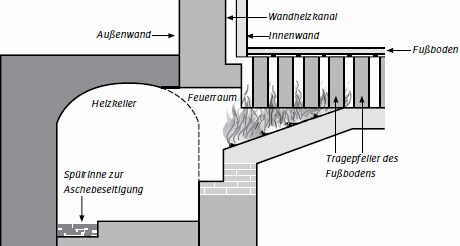

==Test von Karl und Erik, 28 BE gesamt==

Aufgabe 1) **Vokabeln und Grammatik**

a) Markiere alle Prädikate blau, Subjekte rot und Objekte grün! (13 BE)
b) Gibt den Inhalt des Textes wieder! (10 BE)

*Davus möchte Eutychus den Tempel des Iuppiter Maximus zeigen. Über das Forum gehen sie direkt auf den kapitolinischen Hügel zu, wo neben dem Tabularium ein Weg hinaufführt.*

*Hodiē māgna turba Rōmānōrum in forō est: Virī, fēminae, puerī puellaeque aedificia vīsitant. Dāvus et Eutychus per Viam Sacram ad Capitōlium ambulant. Eutychus: „Ecce, statuae virōrum clārōrum et monumenta pulchra! Ecce, columnae$^{1}$ altae māgnī templī!“ Dāvus: „Māgnum aedificium post monumenta est templum Iovis$^{2}$. Ante templum āram vidēs. Hīc Rōmānī summō deō sacrificant. In templō simulācrum sacrum deī est.“ Eutychus: „Nārrā mihi dē templō, Dāve!“ Dāvus: „In templō nōn sōlum cella$^{3}$ Iovis$^{2}$ est, sed etiam cellae Iūnōnis$^{4}$ et Minervae sunt. In cellā sinistrā simulācrum sacrum Iūnōnis est, in cellā dextrā Minervam vidēs, in mediō simulācrum Iovis$^{2}$ est.“ Eutychus stupet et rogat: „Cūr Rōmānī in Capitōliō ūnum$^{5}$ templum tribus$^{6}$ deīs aedificant?“ Dāvus respondet: „Iuppiter et Iūno et Minerva Rōmānōs servant. Rōmānī deīs sacrificant et dōna dant. Deī perīcula ab imperiō Rōmānō prohibent et Rōmānōs cūrīs līberant.“ Eutychus rīdet: „Etiam servōs cūris līberāte, deī Capitōlīnī$^{7}$!“*

1. columna, ae die Säule
2. Iovis Genitiv zu Iuppiter
3. cella, ae die Kapelle, der heilige Raum
4. Iūnōnis Genitiv zu Iūno
5. ūnus, ūna, ūnum ein einziger
6. tribus (Dat. Pl.) drei
7. deī Capitōlīnī Götter vom Kapitol

Aufgabe 2) **Geschichte**

> ⚠️ Bearbeite **EINE** der folgenden Aufgaben!

a) Erkläre die Bedeutung des Circus Maximus für Rom! (5 BE)

b) Erkläre die Funktionsweise einer Hypokaustenheizung, welche in Thermen eingesetzt wurde. (5 BE)

