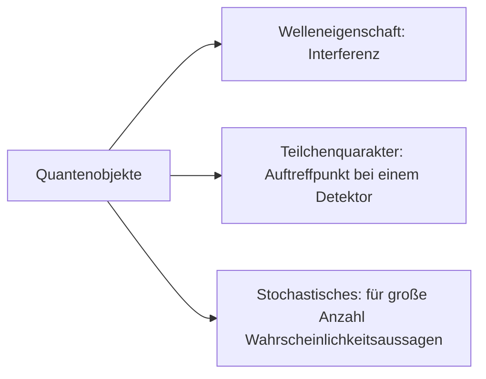

# Schwingungen

## Hooksches Gesetz

(Lb. S. 48)

Die wirkenden Kraft ist direkt proportional zur Auslenkung der Feder ist: $F=Ds$
- $D$ Federkonstante
- $s$ Auslenkung

**Beispiel**
$D=10 \frac{N}{m}$
Man benötigt eine Kraft von $10 N$, um die um $1 m$ zu dehnen.

### Scherung

(Lb. S: 49)

$F\sim \delta$

### Torsion

$F\sim \varphi$

## Größe einer Schwingung

$\hat{y}$ Amplitude (Maximale Auslenkung)
$y$ Elongation (Auslenkung)
$f$ Frequenz in $1Hz=1s^{-1}$
$T$ Periode $T=\frac{1}{f}$

## Harmonische Schwingung

Schwingungen, die durch eine Sinus- oder Kosinusfunktion beschrieben werden kann.

## Zeigerdiagramm

Eine gleichförmige Kreisbewegung kann man gedanklich in zwei harmonische Schwingungen gleicher Frequenz und Amplitude zerlegen, die senkrecht zueinander verlaufen. Umgekehrt kann man sich auch jede harmonische Schwingung als Projektion einer Kreisbewegung denken. Deshalb wird zur Veranschaulichung von harmonischen Schwingungen oft eine Zeigerdiagramm verwendet, in dem ein Zeiger der Länge $A$ mit der Frequenz $f$ um einen festen Punkt rotiert.

## Geschwindigkeit & Beschleunigung bei Schwingungen

Auslenkung
$y(t)=\hat{y}\sin{(\omega t)}$

Geschwindigkeit
$v(t)=\frac{dy}{dt}=\hat{y}\omega\cos{(\omega t)}=\hat{v}\cos{(\omega t)}$ mit $\hat{v}=\hat{y}\omega$

Beschleunigung
$a(t)=\frac{dv}{dt}=-\hat{y}\omega^{2}\sin{(\omega t)}=-\hat{a}\sin{(\omega t)}$ mit $\hat{a}=\hat{y}\omega^{2}$

### Rückstellkraft

$y(t)=\hat{y}\sin{(\omega t)}$
$a(t)=-\hat{y}\omega^{2}\sin{(\omega t)}=-\omega\hat{y}\sin{(\omega t)}=-\omega^{2}y(t)$

$a(t)\sim y(t)\to F_{r}(t)\sim a(t)\sim y(t)$

**Beispiel Federschwinger**
$F_{r}(t)=-Dy(t)$

### Eigenfrequenz Federschwinger

$w_{0}=\sqrt{\frac{D}{m}}$
$f_{0}=\frac{1}{2\pi} \sqrt{\frac{D}{m}}$
$T_{0}=2\pi \sqrt{\frac{m}{D}}$

### Periodendauer Fadenpendel

$w_{0}=\sqrt{\frac{g}{l}}$
$f_{0}=\frac{1}{2\pi} \sqrt{\frac{g}{l}}$
$T_{0}=2\pi \sqrt{\frac{l}{g}}$

## Energieerhaltung einer harmonischen Schwingung

|                | $E_{\text{kin}}$   | $E_{{pot}}$         |
| -------------- | ------------------ | ------------------- |
| Federschwinger | $\frac{m}{2}v^{2}$ | $\frac{1}{2}Dx^{2}$ |
| Fadenpendel    | $\frac{m}{2}v^{2}$ | $mgh$               |

$E_{ges}=E_{pot}+E_{kin}=\frac{1}{2}Dx(t)^{2}+ \frac{1}{2}mv(t)^{2}=\frac{1}{2}D(\hat{x}\cos{\omega t})^{2}+ \frac{1}{2}m (-\hat{x}\omega \sin{\omega t})^{2}$
$\frac{1}{2}D\hat{x}\cos^{2}{\omega t}+ \frac{1}{2}m \hat{v}^{2}\sin{\omega t}=E_{ges}\cos^{2}{\omega t}+E_{ges}\sin^{2}{\omega t}=E_{ges}(\cos^{2}{\omega t}+\sin^{2}{\omega t})=E_{ges}$

## Gedämpfte Schwingung

$\delta=\frac{b}{2m}$
$\omega=\sqrt{\omega_{0}^{2}-\delta^{2}}$

### Reibungskraft = konst.

$W_{R}=\Delta E=F_{R}(\hat{y}_{1}+\hat{y}_{2})$
$\Delta E=\frac{1}{2} D \hat{y}^{2}_{1}- \frac{1}{2}D\hat{y}^{2}_{2}$

$F_{R}(\hat{y}_{1}+\hat{y}_{2})=\frac{1}{2}D(\hat{y}^{2}_{1}-\hat{y}^{2}_{2})$
$F_{R}(\hat{y}_{1}+ \hat{y}_{2})=\frac{1}{2}D(\hat{y}_{1}+\hat{y}_{2})(\hat{y}_{1}-\hat{y}_{2})$
$F_{R}=\frac{1}{2}D(\hat{y}_{1}-\hat{y}_{2})$
$\frac{2F_{R}}{D}=(\hat{y}_{1}-\hat{y}_{2})$
$\hat{y}_{2}=\hat{y}_{1}-\frac{2F_{R}}{D}$

Amplitude nimmt linear  über die Zeit ab.
$\hat{y}_{n+1}=\hat{y}_{n}- \frac{2F_{R}}{D}$

### Reibungskraft ~ Geschwindigkeit

Ansatz
$\vec{F_{s}}=-D\hat{y}$
$\vec{F_{R}}=-b\vec{v}$
$\vec{F_{ges}}=\vec{F_{s}}+\vec{F_{R}}$

$m\vec{a}=-D\vec{y}-b\vec{v}$
$m \frac{d^{2}\vec{y}}{dt}=-D\vec{y}-b \frac{d\vec{y}}{dt}$

Lösung
$y(t)=\hat{y}e^{-st}\cos{\omega t}\quad \text{ mit } \delta=\frac{b}{2m}$
$\omega=\sqrt{\frac{D}{m}-\delta^{2}}$
$f=\frac{1}{2\pi}\sqrt{\frac{D}{m}-\delta^{2}}$

$\hat{y}(t)=\hat{y}e^{-st}$
$y(t)=\hat{y}(t)\cos{(\omega t)}$

### Starke Dämpfung

(Aperiodischer Grenzfall: $\omega_{0}=\delta$)

(Kriechfall: $\omega_{0}<\delta$)

## Resonanz

> Anregung und schwingendes System befinden sich in Resonanz, wenn die Erregerfrequenz und die Eigenfrequenz des Systems gleich sind.

### Erzwungene Schwingung

> Je mehr  sich die Eregerfreqenz einer Eigenfrequenz des Systems nähert, desto mehr Energie pro Periode wird vom Erreger auf dem Oszillator übertragen Im Resonanzfall ist die Energieübertragung maximal.

Erregerfrequenz $f$
Eigenfrequenz $f_{0}$

$f<f_{0}\quad\Delta\varphi\approx0$

$f=f_{0}\quad\Delta\varphi=\frac{\pi}{2}$

$f>f_{0}\quad\Delta\varphi=\pi$

### Elektrischer Schwingkreis

**Skizze** ohne Dämpfung

**Skizze** mit Dämpfung

### Vergleich elektrischer Schwingkreis mit Federschwinger

| Schwingkreis                                 | Federschwinger                                    |
| -------------------------------------------- | ------------------------------------------------- |
| Kondensator wird geladen (maximale Spannung) | Wird gespannt (maximale Auslenkung)               |
| Wird mit Spule verbunden (Schalter umlegen)  | Massestück wird losgelassen                       |
| Spannung nimmt ab; Stromstärke wird größer   | Auslenkung nimmt ab, Geschwindigkeit wird größer  |
| Spannung ist null; Stromstärke maximal       | Auslenkung ist null; Geschwindigkeit maximal      |
| Spannung nimmt zu; Stromstärke wird kleiner  | Auslenkung nimmt zu; Geschwindigkeit wird kleiner |
| Spannung maximal; Stromstärke ist null       | Auslenkung maximal; Geschwindigkeit ist null      |

- Energie Schwingkreis
	- $E_{el}=\frac{1}{2}CU^{2}$
	- $E_{mag}=\frac{1}{2}LI^{2}$

- Energie Federschwinger
	- $E_{pot}=\frac{2}{2}Dy^{2}$
	- $E_{kin}=\frac{1}{2}mv^{2}$

### Ohne Dämpfung

$U_{L}=-L \frac{dI}{dt}=-L \frac{d}{dt}(\frac{dQ}{dt})=-L \frac{d^{2}Q}{dt^{2}}$

$U_{L}=U_{C}$
$-L \frac{d^{2}Q}{dt^{2}}=\frac{Q}{C}$

$-\frac{d^{2}Q}{dt^{2}}=\frac{1}{LC}Q$

$w_{0}=\sqrt{\frac{1}{LC}}$
$f_{0}=\frac{1}{2\pi}\sqrt{\frac{1}{LC}}$

### Mit Dämpfung

$U_{l}=U_{R}+U_{C}$
$U=R \cdot I=R \frac{dQ}{dt}$
$-L \frac{d^{2}Q}{dt}=R \frac{dQ}{dt}+ \frac{Q}{C}$
$\omega=\sqrt{\omega_{0}^{2}-\delta^{2}}\quad\text{ mit }\delta= \frac{R}{2L}$

### Rückkopplungsschaltung nach Meißner

**Rückkopplung**: Periodische Zufuhr von Energie in einem schwingenden System.+

**Schaltplan**

Mit dem Regelbaren Widerstand wird der Arbeitspunkt des Transistors eingestellt. Durch den Schwingkreis wird über die Spule $L_{S}$ eine Wechselspannung in $L_{R}$ induziert. Dadurch liegt auch ein Wechselstrom $I_B$ an der Basis an. Wenn $I_{B}$ maximal ist, schaltet der Transistor in Durchlassrichtung und der Kondensator im Schwingkreis wird wieder auf die maximale Spannung geladen.

**Anwendungen Schwingkreise**: Radio, Fernsehtechnik, Funktechnik

### Wechselstromkreis

**Effektivwert**

$U(t)=R \cdot i(t)$

Wechselstrom: $P=u(t)\cdot i(t)=R \cdot i(t)^{2}$

Gleichstrom: $P=UI=RI^{2}$

Welcher Gleichstrom wäre nötig, um die gleiche Leistung zu bekommen, wie im Mittel bei dem Wechselstrom?

Herleitung

$RI_{eff}^{2}=R \frac{1}{T}\displaystyle\int_{0}^{T}{\hat{I}\sin^{2}{(\omega t)}}dt=R \frac{1}{T} \frac{\hat{I}}{2}T$
$I_{eff}^{2}=\frac{\hat{I}^{2}}{2}$

$I_{eff}=\frac{\hat{I}}{\sqrt{2}}$
$U_{eff}=\frac{\hat{U}}{\sqrt{2}}$

### Zeigerdiagramme

**Widerstand**

#### Kondensator im Wechselstromkreis

**Kondensator**

Der Strom eilt der Spannung um $\frac{\pi}{2}$ voraus.
Kapazitiver Widerstand: 
$U=\hat{U}\sin{\omega t}$
$I=\frac{dQ}{dt}=C \frac{dU}{dt}$
$I=C \frac{dU}{dt}=C\hat{U}\omega\cos{(\omega t)}=\hat{I}\cos{(\omega t)}$
$U=X_{C}\cdot I\to X_{C}=\frac{U}{I}=\frac{\hat{U}}{C\hat{U}\omega}=\frac{1}{C\omega}$

#### Spule im Wechselstromkreis

$U=-L \frac{dI}{dt}$
$I=\hat{I}\sin{(\omega t)}$

$U=-L \frac{d}{dt}\big(\hat{I}\sin{(\omega t)}\big)=-L \omega \hat{I}\cos{(\omega t)}$

**induktiver Widerstand**

$X_{L}=\frac{\hat{U}}{\hat{I}}=\frac{L\omega\hat{I}}{\hat{I}}=L \omega$

### Reihenschaltung von Spule, Kondensator & Widerstand

(Siebkette, Siebkreis, Bandpass)

**Zeigerdiagramm**

$U_{R}$ ist Phasenverschoben zur Stromstärke
$U_C$ ist der Stromstärke hinterher
$U_L$ ist der Stromstärke voraus

$\hat{U}_{ges}=Z \cdot\hat{I}$
$Z=\frac{\hat{U}_{ges}}{\hat{I}}=\frac{\sqrt{\hat{U}_{R}^{2}+(\hat{U}_{L}+\hat{U}_{C})^{2}}}{\hat{I}}=\frac{\sqrt{R^{2}\hat{I}^{2}+((\omega L)+ \frac{1}{\omega C} \hat{I})^{2}}}{\hat{I}}=\frac{\sqrt{\hat{I}^{2}+(R^{2}+ (\omega L-\frac{1}{\omega C} \hat{I}))^{2}}}{\hat{I}}=\sqrt{R^{2}+(\omega L- \frac{1}{\omega C})^{2}}$

Allgemein:
$Z=\sqrt{R^2+X^{2}}$
$\text{Imdepedanz}=\sqrt{\text{ohmscher Widerstand}^{2}+\text{Reaktanz}^{2}}$

### Frequenzabhängigkeit der Impedanz

$\lim\limits_{\omega\to0}Z=\lim\limits_{\omega\to0}\sqrt{R^{2+(\omega L- \frac{1}{\omega C})^{2}}}=\infty\to I=0$
$\lim\limits_{\omega\to\infty}Z=\lim\limits_{\omega\to\infty}\sqrt{R^{2}+(\omega L- \frac{1}{\omega C})^{2}}=\infty\to I=0$

$Z$ ist minimal für: $\omega L- \frac{1}{\omega C}=0\to I=I_{\text{max}}$

### Hochpass und Tiefpass

### Leistung im Wechselstromkreis

$P_{S}=U \cdot I=\sqrt{P_{W}^{2}+P_{B}^{2}}$
$P_{W}=U \cdot I \cdot\cos{\varphi}$
$P_{B}=U \cdot I \cdot\sin{\varphi}$

# Wellen

> Eine mechanische Welle ist die Ausbreitung einer Störung (mechanischer Schwingung) im Raum. Es erfolgt ein Energietransport, aber kein Stofftransport.

Wird die Welle durch eine harmonische Schwingung angeregt, spricht  man von einer harmonischen Welle.

## Wellentypen

### Transversalwelle

- Schwingungsrichtung steht quer zur Ausbreitungsrichtung
- Bsp.: Seilwelle

### Longitudinalwelle

- Schwingungsrichtung und Ausbreitungsrichtung sind parallel
- Bsp.: Schallwelle

### Kreiswelle

- Überlagerung von Longitudinal und Transversalwelle => Kreiswelle
- Bsp.: Wasserwelle

## Beschreibung mechanischer Wellen

$y(t)$-Diagramm Schwingung eines Wellenteilchens an einem bestimmten Ort X.

## Ausbreitungsgeschwindigkeit

$\lambda=c \cdot T$
$c=\lambda \cdot \frac{1}{T}=\lambda \cdot f$

## Wellenfunktion

$y(x,t)=\hat{y}\sin{(2\pi[ \frac{t}{T}- \frac{x}{\lambda}])}$

Minus bei Ausbreitung in positiver x-Richtung.

Herleitung
$y(t)=\hat{y}\sin{(\omega t)}$
$y(t)=\hat{y}\sin{(\omega[t_{1}-\Delta t])}$
$y(t)=\hat{y}\sin{(2\pi f[t_{1}-\Delta t])}$
$y(t)=\hat{y}\sin{(2\pi[t_{1} \cdot f-\Delta t \cdot f])}$
$y(t)=\hat{y}\sin{(2\pi[\frac{t_{1}}{T}- \frac{\delta x}{\lambda}])}$

$y(t,x)=\hat{y}\sin{(2\pi[\frac{t}{T}- \frac{x}{\lambda}])}$

## Huygensches Prinzip

Jeder Punkt einer Wellenfront ist Ausgangspunkt einer kugelförmigen Elementarwelle. Diese Elementarwelle besitz die gleiche Ausbreitungsgeschwindigkeit wie die ursprüngliche Welle. Die Elementarwellen überlagern sich und die Einhüllende aller Elementarwellen bildet die neue Wellenfront.

### Reflexion

Jeder Punkt einer Wellenfront ist Ausgangspunkt einer kugelförmigen Elementarwelle. Die Überlagerung vieler Elementarwellen bildet die neue Wellenfront (einhüllende Wellenfront).
Läuft die Wellenfront von links schräg aur ein Hindernis, so trifft zunächst ein Teil dieser Wellenfront in einem Punkt $P_{1}$ auf die Grenzfläche von Hindernissen. Danach treffen weitere Teile der Wellenfront auf die Grenzfläche in den Punkten $P_{2},P_{3},\dots$ (von links nach rechts). Alle diese Punkte sind Ursprungspunkte von Elementarwellen, deren Wellenfronten die Wellenfront der reflektierten Welle bilden.

- Reflexion bei festem Ende: Es kommt bei der Reflexion zu einem Phasensprung vom Betrag $\pi$ (reflektierte Welle ist um $\frac{x}{2}$ verschoben).
- Reflexion be losem Ende: Reflexion erfolgt ohne Phasensprung.

#### Herleitung Reflexionsgesetz

Da die Wellengeschwindigkeit gleich bleibt, gilt $\bar{AD}=c \cdot t$, $\bar{CB}=c \cdot t$
Beide Dreiecke haben die Seite $\bar{AC}$.
Die beiden Dreiecke sind kongruent zueinander.
Somit gilt $\alpha=\beta$ im Dreieck.

$\frac{\sin{\alpha}}{\cos{\alpha}}=\frac{c_{1}}{c_{2}}$

## Stehende Wellen

Bei der Überlagerung zweier Wellen mit gleicher Frequenz und gleicher Amplitude entsteht ein stabiles Interferenzmuster. Dieses Muster sieht wie eine Welle aus, die sich nicht fortbewegt un wird als stehende Welle bezeichnet. Es bilden sich Orte mit keiner Auslenkung (Knoten) und Orte mit maximaler Auslenkung (Bäuche). Abstand zwischen zwei Bäuche beziehungsweise zwei Knoten beträgt $\frac{\lambda}{2}$ der ursprünglichen Welle.

## Licht als Welle

### Fermatsches Prinzip

Das Licht breitet sich auf den zeitlich kürzesten Weg aus.

### Brechungsindex

$n=\frac{c_{0}}{c_{s}}$
- $c_{0}$ - Vakuum
- $c_{s}$ - Stoff

### Methoden zur Messung der Lichtgeschwindigkeit

#### Bestimmung Lichtgeschwindigkeit im Vakuum

(Siehe Seite 244)

##### Nach Romer (17 Jahrhundert):

##### Nach Fizeau (1848)

$f=12.6Hz$
$d=8633m$
$n=720$

$c=\frac{\Delta s}{\Delta t}$
$\Delta s=2\cdot d$
$T=\frac{1}{f}$
$f_\text{Zahn zu Zahn}=\frac{T}{n}$
$f_\text{Zahn zu Lücke}=\frac{T}{2n}$
$c=\frac{2d}{t_{zl}}=\frac{4dn}{T}=4dnf=4\cdot8633m \cdot720\cdot12.6Hz\approx3.13\cdot10^{8} \frac{m}{s}$

##### Moderne Messungen

(Siehe S. 245)

Laufzeitbestimmmmung mittels Lichtdetektor

$\Delta t= 67ns$
$\Delta s = 20m$
$c=\frac{\Delta s}{\Delta t}=\frac{20m}{67\cdot10^{-9}s}=2.99\cdot10^{8} \frac{m}{s}$
$c=\frac{1}{\sqrt{\epsilon_{0}\cdot\mu_{0}}}$

#### Bestimmung Lichtgeschwindigkeit für verschiedene Stoffe

Brechungsgesetz

$\frac{\sin{\alpha}}{\sin{\beta}}=\frac{c_{1}}{c_{2}}$

$n_{1}=\frac{c_{0}}{c_{1}}$
$n_{2}=\frac{c_{0}}{c_{2}}$
$n_{2}c_{2}=c_{0}=n_{1}c_{1}\to \frac{c_{1}}{c_{2}}=\frac{n_{2}}{n_{1}}$

Lichtgeschwindigkeit mithilfe von Laserentfernungsmesser

Anzeige des Entfernungsmesser $\cases{s_{0}=24.8cm \\ s_{w}=32.2cm}$

Brechung von $c_{w}$ und $n_{w}$

$c_{0}=\frac{s_{0}}{t_{0}}$
$c_{w}=\frac{s_{0}}{t_{w}}$

Anzeige $s_{w}=c_{0}\cdot t_{w}=c_{0}\cdot \frac{s_{0}}{c_{w}}\to s_{w}=\frac{c_{0}s_{0}}{c_{w}}\to c_{w}=\frac{c_{0}s_{0}}{s_{w}}=3\cdot10^{8} \frac{m}{s}\cdot \frac{25cm}{32cm}$
$s_{w}=\approx2.34\cdot10^{8} \frac{m}{s}$
$n_{w}=\frac{c_{0}}{c_{w}}=\frac{s_{w}}{s_{0}}=\frac{32cm}{25cm}=1.28$

### Reflexion, Brechung und Beugung

#### Nachweis Reflexionsgesetz

Mithilfe einer Winkelscheibe Einfallswinkel $\alpha$ und Reflexionswinkel $\alpha'$ messen.

### Beugung von Licht

*Erläuterung mittels Huygenschen Prinzipes*

Jeder Punkt auf einer Wellenfront ist Ursprung einer kugel-/kreisförmigen Elementarwelle. Diese Elementarwellen breiten sich mit der gleichen Geschwindigkeit aus wie die ursprüngliche Welle. Die einhüllende Überlagerung der Wellenfronten der Elementarwellen bildet die neue Wellenfront.

Nach dem Huygenschen Prinzip ist der Punkt $P$ (Teil der Wellenfront, die auf das Hindernis trifft) Ursprung einer kugelförmigen Elementarwelle, die sich in den geometrischen Schattenraum des Hindernisses ausbreitet.

## Interferenz und Polarisation

### Interferenz am Doppelspalt/Gitter

*Für den Doppelsplat gilt*

$a$ Abstand Doppelspalt zu Schirm
$b$ Abstand Spalte
$s_{n}$ Abstand Maximum $n$-ter Ordnung zu $0$-te Ordnung
$\alpha_{n}$ Winkel zwischen Maxima und 

$\tan{\alpha_{n}}=\frac{s_{n}}{a}$

$\sin{\alpha_{n}}=\frac{n\cdot\lambda}{b}$

Für kleine Winkel $\alpha_{n}$ gilt $\sin{\alpha_{n}}\approx\tan{\alpha_{n}}\quad(a\ge10\cdot s_{n})$
$$\frac{s_{n}}{a}\approx \frac{n\cdot\lambda}{b}\quad(n\in\mathbb{N})$$

*Die Gleichung gelten auch für das Gitter*

Gitterkonstante $G$ gibt an, wie groß der Abstrand zwischen den Öffnungen des Gitters sind $G=\frac{1}{b}$
**Beispiel** $G=\frac{1}{100\frac{1}{mm}}$

Das Licht, das durch einen dritten Spalt auf den Schirm trifft, hat den gleichen Gangunterschied zur Lichtwelle des zweiten Splats, wie die Lichtwelle vom 2. Spalt zum 1. Spalt. Weitere Spaltöffnungen verändern nicht die Lage der Maxima, sondern nur deren Intensität, da mehr Licht beim Gitter hindurchdringt.

Beugung in Abhängigkeit von der Wellenlänge

Näherungsformel $\frac{s_{n}}{a}=\frac{n\cdot\lambda}{b}\to s_{n}=\frac{n\cdot\lambda\cdot a}{b}$

Je größer die Wellenlänge, desto größer der Abstand der Maxima. Rotes Licht wird stärker gebeugt als blaues Licht.

**Einfluss $a$** Je größer $a$, desto größer der Abstand der Maxima
**Einfluss $b$** Je größer $b$, desto kleiner der Abstand der Maxima

### Kohärentes Licht

Interferenzmuster kommen nur bei kohärentem Licht zustande. Das heißt, dass die Wellenzüge ausreichend lang sind, um zu interferieren und die gleuche Frequenz besitzen.

### Interferenz an dünnen Schichten

An dünnen Schichten tritt bei Reflexion konstruktive Interferenz (Verstärkung) auf, wenn der Gangunterschied zwischen den an Vorder- und Rückseite reflektierten Wellen ein ganzzahliges Vielfaches von $\lambda$ beträgt.
1. Lichtstrahlen unterschiedlicher Wellenlänge (Farben) werden unterschiedlich gebrochen (Dispersion) und teilweise reflektiert.
2. Lichtstrahlen werden an der Innenseite der dünnen Schicht reflektiert.
3. Beim Austreten von Lichtstrahlen aus der dünnen Schicht überlagern sich diese Lichtstrahlen, die an der Oberfläche reflektiert werden.

Gangunterschied für Maxima:
$$2d=(2k+1) \frac{\lambda_\text{Medium} }{2}=(2k+1) \frac{\lambda}{2n_{F}}$$

Gangunterschied für Minimum:
$$2d=(k+1) \lambda_\text{Medium}=(k+1) \frac{\lambda}{n_{F}}$$
### Newtonsche Ringe

Beim reflektierten Licht kommen die Interferenzerscheinungen durch das einerseits an der  Rückseite der Linse reflektierte Licht und andererseits dan an der Vorderseite der Glasplatte reflektierte Licht zustande (schwarze Strahlen).

### Interferenzmuster an aufgespannter Seifenschicht

**Dunkler Bereich**
Schichtdichte geht gegen Null
- Phasenverschiebung fast nur durch Phasensprung $\frac{\lambda}{2}$ durch Reflexion
- Destruktive Interferenz

**Gelblicher Bereich**
Schichtdichte nimmt nach unten hin zu
- Licht mit kürzester Wellenlänge, als blaues/violettes Licht interferiert als erstes destruktiv
- Andere Lichtwellenlängen (Farben) werden normal reflektiert
- blaues Licht fehlt im reflektierten Licht
- Gelbfärbung

## Polarisation

Licht natürlicher Lichtquellen (Sonne, Feuer) sowie der meisten künstlichen Lichtquellen (Glühlampen, Leuchtstoffröhre) schwingt in den unterschiedlichen Richtungen. Laserlicht schwingt dagegen nur in eine Richtung (es ist linear polarisiert).

### Faraday-Effekt

Die Polarisationsebene einer linear polarisierten Lichtwelle kann in einem Medium (z.B. Glas) gedreht werden, wenn darin ein Magnetfeld parallel zur Ausbreitungsrichtung der Wellen herrscht. Aus dieser Beobachtung kann man schlussfolgern, dass es sich bei Licht um eine elektromagnetische Welle handelt.

### Gesetz von Malus

$I_{t}=I_{e}\cos^{2}{\vartheta}$

## Brewstersches Gesetz

Stehen reflektierter und gebrochener Lichtstrahl an der Grenzfläche zweier Stoffe senkrecht zueinander, dann ist das reflektierte Licht vollständig linear polarisiert.
$$\frac{n_{2}}{n_{1}}=\tan{\alpha_{p}}$$

Herleitung Brewster-Winkel
$\frac{\sin{\alpha}}{\sin{\beta}}=\frac{n_{2}}{n_{1}}\implies\frac{\sin{dp}}{\sin{90-dp}}=\frac{\sin{dp}}{cos{dp}}=\frac{n_{1}}{n_{2}}\implies\tan{\alpha}=\frac{n_{2}}{n_{1}}$

### Doppelbrechung

Stoffe, bei denen Doppelbrechung auftreten, nennt man optisch anisotrop. Die anderen Stoffe heißen optisch isotrop.

### Flüssigkeitskristallanzeigen

(LCD - Liquid Cristal Display)

### Herleitung Brechungsgesetz nach Fermatschen Prinzip

$t(x)=\frac{l_{1}}{c_{1}}+ \frac{l_{2}}{c_{2}}=\frac{\sqrt{a^{2}+x^{2}}}{c_{1}}+\frac{\sqrt{b^{2}+(d-x)^{2}}}{c_{2}}$
$\frac{dt}{dx}=0=\frac{1}{c_{1}}(a^{2}+x^{2})^{\frac{-1}{2}}\cdot x+\frac{1}{c_{1}}(b^{2}+(d-x)^{2})^{\frac{-1}{2}}\cdot(d-x)\cdot(-1)$
$0=\frac{x}{c_{1}\sqrt{a^{2}+x^{2}}}- \frac{d-x}{c_{2}\sqrt{b^{2}+(d-x)^{2}}}$
$0=\frac{x}{c_{1}l_{1}}- \frac{d-x}{c_{2}l_{2}}$

$\sin{\alpha}=\frac{x}{l_{1}}\quad\sin{\beta}=\frac{d-x}{l_{2}}$
$0=\frac{\sin{\alpha}}{c_{1}}- \frac{\sin{\beta}}{c_{2}}$
$\frac{\sin{\alpha}}{c_{1}}=\frac{\sin{\beta}}{c_{2}}$
$\frac{\sin{\alpha}}{\sin{\beta}}=\frac{c_{1}}{c_{2}}$

# Quantenphysik

$E_{\text{ph}}=h\cdot f_{g}$
$E_{\text{ph}}=f\cdot f_{uv}$
$f_{g}<f_{uv}$
$E_{\text{ph, gelb}}<E_{\text{ph, uv}}$

## Fotoeffekt

Als äußeren photoelektrischen Effekt bezeichnet man das Herauslösen von Elektronen aus einer Halbleiter- oder Metalloberfläche durch Bestrahlung.

## Modelle für das Licht

| Modell Lichtstrahlen                                         | Modell Wellen                                          | Modell Teilchen                            |
| ------------------------------------------------------------ | ------------------------------------------------------ | ------------------------------------------ |
| Eignet sich zur Beschreibung des Wegs, den Licht zurücklegt. | Eignet sich zu Erklärung von Beugung und Interferenz. | Eignet sich zur Erklärung des Fotoeffekts. |
| Keine Aussage zur Natur des Lichts                           | Licht hat Wellencharakter                              | Licht hat Teilchencharakter                |

## Energie eines Photons

$h$ planksches Wirkungsquantum mit $6.626\cdot10^{-34}Js$
$f$ Frequenz
$$E_\text{ph}=h\cdot f=h\cdot \frac{c}{\lambda}$$

Energie mehrere Photonen
$n$ Anzahl Photonen
$$E=n\cdot h\cdot f=n\cdot h\cdot \frac{c}{\lambda}$$

### Äußere lichtelektrischer Effekt im Photonenmodell

$E_{\text{ph}}=W_{A}+E_{\text{kin}}$

### Energiebilanz

### Gegenfeldmethode

- Regelbare Spannungsquelle ist zwischen Kathode und Anode angeschlossen
- Gegenspannung an der regelbaren Spannungsquelle wird so eingestellt, dass die Stromstärke null ist ($I=0$)
- Mithilfe der Gegenspannung U kann die kinetische Energie der herausgelösten Elektronen bestimmt werden: $E_\text{kin}=e\cdot U$

### Einstein-Gerade

Anstieg der Einstein-Gerade ist das plancksche Wirkungsquantum $h$.

$E_\text{ph}=E_\text{kin}+W_{A}$
$E_{\text{kin}}(f)=W_{A}+h\cdot f\to m+n\cdot x$

### Impuls-Photon

$E=m\cdot c^{2}$
$E=h\cdot f$

$m\cdot c^{2}=h\cdot f$
$mc=h\cdot \frac{f}{c}$
$$p=h\cdot \frac{f}{c}=\frac{h}{\lambda}$$

$$m=\frac{h\cdot f}{c^{2}}$$

## Materiewellen

### De-Broglie-Wellenlänge

$$\lambda=\frac{h}{p}=\frac{h}{m\cdot v}$$

### Leuchtdiode

Umkehrung des lichtelektrischen Effekts.

- Elektronen und Löcher: In einem Halbleitermaterial, wie zum Beispiel Silizium, gibt es Elektronen, die sich frei bewegen können, sowie "Löcher", die durch fehlende Elektronen entstehen. Diese Elektronen und Löcher tragen zur elektrischen Leitfähigkeit des Materials bei.
- Dotierung: Um eine LED herzustellen, wird der Halbleiter mit bestimmten Fremdatomen dotiert, um die Elektronen- und Lochträgerkonzentration zu verändern. Bei einer speziellen Art von LEDs, den Galliumarsenid-LEDs beispielsweise, werden Gallium- und Arsenatome verwendet.
- Rekombination: Wenn eine Spannung an die LED angelegt wird, werden Elektronen und Löcher durch den Halbleiter bewegt. Wenn Elektronen auf Löcher treffen, können sie rekombinieren, wobei Energie freigesetzt wird.
- Energieemission: Die freigesetzte Energie manifestiert sich in Form von Licht. Die Farbe des Lichts hängt von der Bandlücke des Halbleitermaterials ab. Die Bandlücke ist die Energielücke zwischen dem Valenzband und dem Leitungsband des Materials.

## Vergleich makroskopischer Objekte und Quantenobjekte

Für makroskopische Objekte überlagern sich die Häufungsbereiche der einzelnen Spalte. 

Für viele Quantenobjekte ergibt sich ein Interferenzmuster. Für wenige ergibt sich kein Muster (kein gesetzmäßige Zusammenhang).

Bei makroskopischen Objekten kann man vorhersagen durch welchen Spalt das Objekt geht. Bei Quantenobjekten ist keine Vorhersage möglich.

| markroskopische Objekte                                                    | Quantenobjekte                                                                                                         |
| -------------------------------------------------------------------------- | ---------------------------------------------------------------------------------------------------------------------- |
| bewegen sich auf konkreten Bahnen                                          | bewegen sich nicht auf Bahnen                                                                                          |
| Anzahl der Objekte ändert nichts an der Vorhersagbarkeit eines Ergebnisses | Geringe Anzahl kann man keine Anzahl treffen, bei vielen Wahrscheinlichkeitsaussagen möglich                           |
| Ort und Impuls sind an den Grenzen der Messgenauigkeit bestimmbar          | Je genauer der Ort eines Quantenobjektes bestimmt wird, desto ungenauer kann der Impuls bestimmt werden und umgekehrt. |

### Komplementaritätsprinzip

> Ortsmessung und Interferenzerscheinungen sich nicht gleichzeitig realisierbar. Sie schließe sich gegenseitig aus.

## Heisenbergsche Unschärfenrelation

$\Delta x$ Ortsunschärfe
$\Delta p$ Impulsunschärfe
$$\Delta x\cdot\Delta p\ge \frac{h}{4\pi}$$

## Vergleich Photon & Elektron

| Eigenschaft     | Photon                                                                                                                                               | Elektron                                                                        |
| --------------- | ---------------------------------------------------------------------------------------------------------------------------------------------------- | ------------------------------------------------------------------------------- |
| Masse           | ruhe Masse 0, da es sich mit Lichtgeschwindigkeit bewegt, besitzt es eine Masse (relativistische Effekte)                                            | ruhe Masse $\approx9.1\cdot10^{-31}kg$                                          |
| Geschwindigkeit | Bewegt sich mit Lichtgeschwindigkeit                                                                                                                 | Elektron kann jede Geschwindigkeit zwischen 0 und Lichtgeschwindigkeit annehmen |
| Energie         | Energie für bestimmte Frequenz konstant                                                                                                              | Energie abhängig von der Geschwindigkeit                                        |
| Ladung          | Besitzt keine Ladung                                                                                                                                 | Einfach negativ geladen                                                         |
| Ablenkbar       | Kann in elektrischen Feldern nicht abgelenkt werden                                                                                                  | Kann in elektrischen Feldern abgelenkt werden (Lorentz-Kraft)                   |
| Wechselwirkung  | Ist elektromagnetische Strahlung -> ist "Träger" von magnetischen und elektrischen Feldern und somit "Träger" von elektromagnetischer Wechselwirkung | Wechselwirkung mit anderen geladenen Teilchen aufgrund der Ladung               |

# Atommodell

## Frühere Atommodelle

### Griechische Atomisten

- Physik als Intellektuelle Auseinandersetzung
- Idee der Atome von Leukipp und Demokrit
- Atomos -> "Das Unteilbare"
- Atome galten als kleinste mögliche Bausteine und existierten Ewig
- Eigenschaften von Materie durch ihre Atome erklären

### Atome bei John Dalton

- systematische und quantitative Untersuchungen
- Elemente verbinden sich nur vollständig bei einfachen Masseverhältnissen
- Jedes Element besteht aus kleinsten unteilbaren Atomen
- Atome haben eine typische Masse
- Für eine Reihe von Molekülen hat er mögliche Kombination angegeben

### Atomaufbau nach J. J. Thomson

- Experimentierte mit Kathodenstrahlröhrschen
- Wies nach, dass Strahlung aus negativ geladenen Teilchen bestand
- Atommodell bestand aus positiver Masse, in der sich negative Elektronen befanden

### Rutherfords Atommodell

- konnten mithilfe von Alphateilchen die Bahnen rekonstruieren
- Eins von etwa 8000 Teilchen entsprach jedoch nicht der gedachten Bahn
- Die Bahnen wurden mit einem neuen Atommodell begründet
- Atome waren weitgehend leer
- Im Zentrum befindet sich ein kleiner kompakter Kern
- Deutlich leichtere Elektronen umkreisen den Atomkern
- Da Elektronen geladen sind, müssten sie Strahlung abgeben, wodurch sie Energie verlieren und in den Kern stürzen müsste
- Boor löste dieses Problem, indem die Elektronen sich auf festen Bahnen um den Kern bewegen, auf denen sie keine Energie verlieren

## Bohrsches Atommodell

### Postulate

1. Es existieren stabile Bahnen, auf denen die Elektronen kreisen, ohne Strahlung auszusenden.
2. Es sind nur Bahnen erlaubt, für die gilt:

 $m$ Masse Elektronen
 $v$ Geschwindigkeit Elektronen
 $r$ Bahnradius
 $n$ Bahnnummer ($n\in\mathbb{N}, n>0$)
$$m\cdot v\cdot r=n \frac{h}{2\pi}$$

Herleitung
$2\pi r=n\lambda$
$\lambda=\frac{h}{mv}$

Einsetzen
$\frac{nh}{mv}=2\pi r$
$n\frac{h}{2\pi}=mvr$

3. Die Emissionen oder Absorption von Photonen erfolgt genau dann, wenn ein Elektron von einer erlaubten Bahn auf eine andere erlaubte Bahn wechselt.
4. Jeder erlaubten Elektronenbahn entspricht eine bestimmte Energie der Elektronen. Wechselt ein Elektron die Bahn, so ist die Energie emittierten bzw. absorbierten Photons gleich der Energiedifferenz der Bahnenergien.

$$\Delta E=h\cdot f$$

### Bohrscher Radius

Elektron bewegt sich auf Kreisbahn: Radialkraft notwendig! $F_{r}=m \frac{v^{2}}{r}$
Coulombkraft ist hier die Radialkraft: $m \frac{v^{2}}{r}=\frac{1}{4\pi\epsilon_{0}\epsilon} \frac{qQ}{r^{2}}$

Für die Beträge gilt: $q=Q=e$

$m \frac{v^{2}}{r}=\frac{1}{4\pi\epsilon_{0}\epsilon}\cdot \frac{e^{2}}{r^{2}}$

Das 2. Bohrsches Postulat einsetzen
$mvr=n\cdot \frac{h}{2\pi}\to v=\frac{n\cdot h}{mr2\pi}\to m \frac{n^{2}h^{2}}{m^{2}r^{2}4\pi^{2}r}=\frac{1}{4\pi\epsilon_{0}\epsilon} \frac{e^{2}}{r^{2}}$
$\frac{n^{2}h^{2}}{m \pi r}=\frac{1}{\epsilon_{0}\epsilon}e^{2}$
$r=\frac{n^{2}h^{2}\epsilon_{0}\epsilon}{m\pi e^{2}}$
2
Da Bohrscher Radius $n=1$ und kein Stoff sich zwischen Atomen befindet, gilt:
$r=\frac{h^{2}\epsilon_{0}}{m\pi e^{2}}$
$r=\frac{(6.626\cdot10^{-34}Js)^{2}\cdot8.854\cdot10^{-12}\frac{As}{Vm}}{9.109\cdot10^{-31}kg\cdot\pi\cdot(1.602\cdot10^{-19}As)^{2}}=5.29\cdot10^{-11}m$

$1 \dot{A}=1 \mathrm{Angström}=100pm=0.1nm$
Bohrscher Radius $\approx0.05nm\approx \frac{1}{2}\dot{A}$

### Energieniveau im bohrschen Atommodell

$E_{\text{ges}}=E_{\text{kin}}+E_{\text{pot}}$
$\lim_\limits{r\to\infty}E_{\text{pot}}=0$
(Elektron hat sich vom Atom gelöst)

$E_{\text{kin}}=\frac{m}{2}v^{2}$
$F_{\text{Coloumb}}=F_{R}\Rightarrow \frac{1}{4\pi\epsilon_{0}} \frac{e^{2}}{r^{2}}=m \frac{v^{2}}{r}\Rightarrow mv^{2}=\frac{1}{4\pi\epsilon_{0}} \frac{e^{2}}{r}$

Kraft in Energie einsetzen
$E_{\text{kin}}=\frac{1}{2} \frac{1}{4\pi\epsilon_{0}} \frac{e^{2}}{r}=\frac{1}{8\pi\epsilon_{0}} \frac{e^{2}}{r}$
$W_{R}=\Delta E_{\text{pot}}=E_{\text{pot}}(r)-E_{\text{pot}}(\infty)=E_{\text{pot}} (r)-0=E_{\text{pot}}(r)$
$\begin{split}W_{R}&=E_{\text{pot}}(r)=\displaystyle\int_{\infty}^{r}F\mathrm{d}s\\ &=\displaystyle\int_{\infty}^{r} \frac{1}{4\pi\epsilon_{0}} \frac{e^{2}}{s^{2}}\mathrm{d}s=\frac{e^{2}}{4\pi\epsilon_{0}} \displaystyle\int_{\infty}^{r} \frac{1}{s^{2}}\mathrm{d}s\\ &=\frac{e^{2}}{4\pi\epsilon_{0}}[-s^{-1}]_{\infty}^{r}=\frac{e^{2}}{4\pi\epsilon_{0}} \lim_{b\to\infty}(- \frac{1}{r}+ \frac{1}{b})\\ &=\frac{-e^{2}}{4\pi\epsilon_{0}} \frac{1}{r}(<0)\end{split}$

$E_{\text{ges}}$ ergibt sich aus potentieller und kinetischer Energie
$E_{\text{ges}}=E_{\text{kin}}+E_{\text{pot}}=\frac{e^{2}}{8\pi\epsilon_{0}} \frac{1}{r}- \frac{e^{2}}{4\pi\epsilon_{0}} \frac{1}{r}=- \frac{e^{2}}{8\pi\epsilon_{0}} \frac{1}{r}$

$r=\frac{h^{2}\epsilon_{0}}{\pi e^{2}m}n^{2}$ in $E_{\text{ges}}$ einsetzen
$E_{\text{ges}}=- \frac{e^{2}}{8\pi\epsilon_{0}} \frac{1}{\frac{h^{2}\epsilon_{0}}{\pi e^{2}m}n^{2}}$
$E_{\text{ges}}=- \frac{e^{4}\pi m}{8\pi\epsilon_{0}^{2}h^{2}} \frac{1}{n^{2}}=-\frac{e^{4}m}{8\epsilon_{0}^{2}h^{2}}\cdot\frac{1}{n^{2}}$

### Serienformel für Wasserstoff

Geht ein Elektron von der $m$-ten auf die $n$-te Bahn (Zustand) über mit $m>n$, dann wird ein Photon mit der Energie $E_{\text{ph}}=E_{m}-E_{n}$ ausgestrahlt.

$E_{\text{ph}}=-\frac{e^{4}m}{8\epsilon_{0}^{2}h^{2}}\cdot(\frac{1}{m^{2}}- \frac{1}{n^{2}})=\frac{e^{4}m}{8\epsilon_{0}^{2}h^{2}}\cdot(\frac{1}{n^{2}}- \frac{1}{m^{2}})$
$E_{\text{ph}}=h\frac{e^{4}m}{8\epsilon_{0}^{2}h^{3}}(\frac{1}{n^{2}}- \frac{1}{m^{2}})$

$R_{H}=\frac{e^{4}m}{8\epsilon_{0}^{2}h^{3}}=3.2898\cdot10^{15}Hz$

$E_\text{ph}=h\cdot f=h\cdot R_{H}(\frac{1}{n^{2}}- \frac{1}{m^{2}})$
$f=\frac{E_{\text{ph}}}{h}=R_{H}(\frac{1}{n^{2}}- \frac{1}{m^{2}})$

$$f=R_{H}(\frac{1}{n^{2}}- \frac{1}{m^{2}})$$

### Energieniveauschema

#### Serien

Lyman Serie
$E_{2\to 1}=1.63489\cdot10^{-18}J=10.204eV$
$E_{3\to1}=1.93765\cdot10^{-18}J=12.0937eV$
$E_{4\to1}=2.04361\cdot10^{-18}J=12.755eV$
$E_{\infty\to1}=2.17985\cdot10^{-18}J=13.6eV$

$E=hf=h \frac{c}{\lambda}$
$\lambda=\frac{hc}{E}$

$\lambda_{2\to1}=121.588nm$
$\lambda_{3\to1}=102.59nm$
$\lambda_{4\to1}=97.2705nm$
$\lambda_{\infty\to1}=91.1911nm$

Balmer-Serie
$\lambda_{3\to2}=656.57nm$
$\lambda_{4\to2}=486.352nm$
$\lambda_{\infty\to2}=364.764nm$

Paschen-Serie für $n=3$

Serien sind immer für Strahlung die Entsteht, wenn ein Elektron von einem höherem auf ein niedrigeres Niveau geht.

#### Möglichkeiten & Grenzen des bohreschen Atommodells

Möglichkeiten
- Ermöglicht eine Abschätzung des Atomradius
- Spektrallinien für Wasserstoff können berechnet werden
- Führt quantentheoretische Erkenntnisse in die Atomtheorie ein (Emission & Absorption von Licht)

Grenzen
- Widerspruch von diskreten Bahnen (Kreisbahnen) zur Quantentheorie (Quantenteilchen bewegen sich nicht auf konkreten Bahnen)
- Modell versagt bei Vorhersagen für Atome mit mehr als einem Elektron (nur Wasserstoffatom beschreibbar)
- Postulate erscheinen willkürlich (Elektronen senden keine Strahlen aus)

## Quantenmechanisches Atommodell

### Schrödinger Gleichung

$i$ imaginäre Einheit (komplexe Zahlen)
$\Psi$ Wellenfunktion oder Zustandsfunktion eines Quantenteilchens
$\hat{H}$ Hamiltonoperator (gibt Energieinformation und Zeitentwicklung eines quantenmechanischen Systems an)
$$i \frac{h}{2\pi} \frac{\partial \Psi}{\partial t}=\hat{H}\Psi$$

### Zustandsfunktion

 - Ein System wird durch die Zustandsfunktion $\Psi$ beschrieben
 - Aussagen über Ort und Impuls (Geschwindigkeit) eines Teilchens zu einem bestimmten Zeitpunkt sind in der Zustandsfunktion enthalten
 - Wahrscheinlichkeit, dass ein Quantenobjekt in einem gewissen Ortsbereich nachgewiesen werden kann, ist direkt proportional zum Betragsquadrat der Zustandsfunktion ($|\Phi|^{2}$)

#### Unendlich tiefer eindimensionaler Potenzialtopf

Modell für gebundene Objekte:
- Elektronen können sich nur in einem Bereich entlang der x-Achse frei bewegen($0<x<L$)
- Diese Einschränkung führt zu diskreten Energieniveaus

Energieniveaus

$mv=p=\frac{h}{\lambda}$
$L=\frac{n}{2}\lambda\quad n\in\mathbb{N}$
$E=\frac{m}{2}v^{2}=\frac{m^{2}v^{2}}{2m}=\frac{p^{2}}{2m}=\frac{h^{2}}{2m\lambda^{2}}=\frac{h^{2}n^{2}}{2m4L^{2}}=\frac{h^{2}}{8mL^{2}}n^{2}$

Energie des Grundzustandes
$E_{1}=\frac{h^{2}}{8mL^{2}}$

Energieniveau
$E=E_{1}n^{2}$

Lösen der Schrödinger Gleichung führt zu folgender Zustandsfunktion:
$\Phi_{n}(x)\sim\sin{(\frac{n\pi}{L}x)}$

### Schalenmodell / Orbitalmodell

Zustände werden über "stehende Wellen" definiert → Lösungen der Schrödinger Gleichung

Einer vorgegebenen Hauptquantenzahl $n$ kann man $2n^{2}$ verschiedene Kombinationen aus $n,l,m$ und $s$ zuordnen → Anzahl Elektronen pro Schale

#### Pauli-Prinzip

In einem Atom können niemals mehrere Elektronen in allen Quantenzahlen übereinstimmen.

#### Quantenzahlen

| Quantenzahl                   | Bedeutung                                       | Mögliche Werte      |
| ----------------------------- | ----------------------------------------------- | ------------------- |
| Hauptquantenzahl $n$          | Energieniveau in Atomhülle bzw. Schale          | $n=0,1,2,\dots$     |
| Bahndrehimpulsquantenzahl $l$ | Kennzeichnet das Orbital                        | $l=0,1,2,\dots,n-1$ |
| Magnetquantenzahl $m$         | Kennzeichnet Orbitale nach Orientierung im Raum | $m=-l,\dots,+l$     |
| Spinquantenzahl $s$           | Richtung der Eigenrotation des Elektrons        | $s=\pm \frac{1}{2}$ |

#### Elektronenkonfiguration

**Beispiele**
Lithium $1s^{2}2s^{2}$
In der ersten Schale beim s-Orbital 2 Elektronen

Magnesium $1s^{2}2s^{2}2p^{6}3s^{2}$
12 Elektronen gesamt

## Franck-Hertz-Experiment

- Durchgeführt von James Franck und Gustav Hertz (1911-1914)

**Interpretation**
Durch die Beschleunigungsspannung $U_{B}$ werden die Elektronen von der Kathode bis zur Anode beschleunigt. Ab einer gewissen Spannung $U_{B}$ stoßen die Elektronen unelastisch mit den $Hg$-Atomen zusammen. Dadurch werden von den $Hg$-Atomen von dem Grundzustand in den nächst höheren Energiezustand gehoben. Wenn diese wieder in den Grundzustand zurückfallen, werden Photonen ausgesendet (Gas leuchtet).
Freie Elektronen, die durch unelastische Stöße mit dem $Hg$-Atomen Energie abgeben haben, besitzen nicht genug kinetische Energie, um die Gegenspannung zu überwinden. Dadurch kommen weniger Elektronen an der Anode an und die Stromstärke sinkt.

## Resonanzabsorption und Lumineszenz

Resonanzabsorption
- Bei Bestrahlung mit weißem Licht wird ein Atom von Photonen unterschiedlichster Frequenz bzw. Energie getroffen
- Das Atom kann ein Photon nur dann absorbieren wenn dessen Energie genau der Differenz zwischen zwei Atomaren Energieniveaus $E_{1}$ und $E_{2}$ entspricht
- $E_{\text{ph}}=h\cdot f=E_{2}-E_{1}$

Lumineszenz
- Das Photon der Resonanzabsorption wird für eine gewisse Zeit gespeichert
- Beim Übergang in ein niedrigeres Energieniveau wird das Photon wieder ausgesendet

Fluoreszenz
- Bestrahlung mit Licht
- Emittiertes Licht hat selbe Frequenz wie absorbiertes Licht
- Innerhalb von $10^{-8}s$

Phosphoreszenz
- Prozess deutlich Länger

Frequenzänderung bei Lumineszenz
- Beim Aussenden des Photons bleibt ein Teil der Energie im Atom zurück
- Da das Photon mit weniger Energie emittiert wird, ist die Frequenz auch kleiner

### Emissionsspektrum

- Nur die emittierte Frequenz ist sichtbar, alle anderen Teile des Spektrums sind schwarz

### Absorptionsspektrum

- Nur die absorbierte Frequenz ist schwarz, alle anderen Teile des Spektrums sind sichtbar

## Laser

### Funktionsprinzip Laser

Spontane Emission: Emission eines Photons erfolgt spontan nach einer nicht genau bestimmten Zeit.

Stimulierte/Induzierte Emission: Emission eines Photons wird durch ein Photon mit gleicher Wellenlänge ausgelöst.

Wirkungsweise
- Energiequelle bringt Atome des aktiven Mediums (= Lasermedium) in einem angeregten Zustand
- durch spontane Emission werden Photonen ausgesendet
- diese Photonen lösen durch stimulierte weitere Photonen aus
- an den Spiegeln werden die Photonen reflektiert und verstärken somit die induziert Emission
- ein Teil der Photonen verlässt das aktive Medium als Laserstrahlung durch den halbdurchlässigen Spiegel

### Eigenschaften Laserstrahlung

- ist paralleles Licht
- besitzt eine hohe Leistungsdichte
- ist monochromatisch (besitzt bestimmte Frequenz)
- ist vollständig polarisiert
- ist kohärentes Licht

Durch stimulierte (induzierte) Emission werden Photonen erzeugt, die in Bewegungsrichtung, Phasenbeziehung und Frequenz mit anderen zuvor ausgelösten Photonen übereinstimmen.

Besetzungsinversion:
- Je höher die Energie eines Zustands, umso geringer ist die Besetzungswahrscheinlichkeit
- Für Lichtverstärkung muss die Mehrheit der Atome in höhere Energieniveaus befördert werden
- Obere Laserniveaus sind relativ langlebig und werden somit durch spontane Übergänge nicht abgebaut
- Untere Laserniveaus sind relativ kurzlebig, wodurch die Laserstrahlung nicht durch Absorption stark abgeschwächt wird

# Thermodynamik

## Innere Energie

Innere Energie $U$: Sämtliche Energieformen, die innerhalb eines Systems $s$ vorliegen, werden in der Summe als innere Energie $U$ bezeichnet.

**Beispiele**
- potenzielle Energie der Teilchenschwingung
- kinetische Energie von Teilchen
- (chemische) Bindungsenergie

Bei Festkörpern gilt:
- $U=E_{\text{kin}}+E_{\text{pot}}$ (Teilchenschwingung)
- Innere Energie, die man benötigt um einen Körper zu Schmelzen wird als Schmelzwärme $Q_{s}$ bezeichnet: $Q_{s}=q_{s}\cdot m$, wobei $q_{s}$ die spezifische Schmelzwärme ist
- $[q_{s}]= \frac{kJ}{kg}$

Bei Flüssigkeiten gilt:
- $U=E_{\text{kin}}+E_{\text{pot}}$ ($E_{\text{pot}}$ geringer als bei Festkörpern)
- Verdampfungsprozess $U=Q_{v}=q_{v}\cdot m$ (Verdampfungswärme)

Bei Gasen gilt:
- $U=E_{\text{kin}}$ (Translation & Rotation, $E_{\text{pot}}\approx0$)

### Boltzmann Verteilung

## Ideales Gas

### Druck und Temperatur

$p= \frac{F}{A}$

|         | Formelzeichen | Einheit       | Fixpunkt                              |
| ------- | ------------- | ------------- | ------------------------------------- |
| Celsius | $\vartheta$   | ${}^{\circ}C$ | 100 °C Siedepunkt und 0° Schmelzpunkt |
| Kelvin  | $T$           | $K$           | absoluter Nullpunkt                   |

$0K = -273^{\circ}C$

$T\;\text{in}\;K=\vartheta\;\text{in}^{\circ}C+273$

### Eigenschaften

- Lösen nur vollkommen elastische Stöße untereinander aus.
- Es gibt keine weiteren Anziehungs- oder Abstoßungskräfte untereinander
- Gesamtenergie der Teilchen ist ausschließlich ihre kinetische Energie ihrer Translationsbewegung
- Keine Aggregatzustandsänderung

$$p \cdot V=n \cdot R \cdot T$$

> $p$, $T$ und $V$ sind Zustandsgrößen!

## Thermodynamisches Gleichgewicht und Wärme

### Mechanisches & chemisches Gleichgewicht

Besteht bei zwei miteinander verbundenen Systemen ein Druck- oder Konzentrationsunterschied, so gleichen sich Druck und Konzentration über die Zeit aus.

### Thermisches Gleichgewicht

Besitzen zwei miteinander verbundene Systeme einen Temperaturunterschied, so gleicht sich die Temperatur der Systeme über die Zeit an.

### Wärme $Q$

Thermische Energie, die von einem System aufgenommen oder abgegeben wird, aufgrund eines Temperaturunterschiedes.

$$Q=mc\cdot \Delta T=mc\cdot (T_{\text{end}}-T_{\text{an}})$$
$\Delta T$ Temperaturunterschied
$m$ Masse
$c$ Spezifische Wärmekapazität ($c_{p}$ wenn Druck konstant, $c_{v}$, wenn Volumen konstant)

> $Q>0$ Wärmeaufnahme
> $Q<0$ Wärmeabgabe

**Beispiel**
$c_{\ce{H2O}}=4.19\frac{kJ}{kg\cdot K}$
Man benötig 4.19 kJ, um 1 kg Wasser um 1 K zu erwärmen.

> Temperaturdifferenzen sind unabhängig ob gegeben in Kelvin oder Grad Celisus.

### Mischtemperatur

$m_{1}c_{\ce{H2O}}(T_{1}-T_{m})+m_{1}c_{\ce{H2O}}(T_{2}-T_{M})=0$
$T_{M}(m_{1}c_{\ce{H2O}})+m_{2}c_{\ce{H2O}}=m_{1}c_{\ce{H2O}}T_{1}+m_{2}c_{\ce{H2O}}+T_{2}$
$T_{M}=\frac{m_{1}c_{\ce{H2O}}T_{1}+m_{2}c_{\ce{H2O}}T_{2}}{m_{1}c_{\ce{H2O}}+m_{2}c_{\ce{H2O}}}$

### Wärmestrahlung

Körper, welche wärmer sind als die Umgebung, emittieren Wärme, wobei sie Energie über Zeit an die Umgebung abgeben (Strahlung). Dies passiert solange, bis sich Körper und Umgebungstemperatur ausgeglichen haben.

### Wärmeleitung

Ist an Materie gebunden, wobei Teilchen durch Bewegung bzw. Schwingung Energie austauschen. Wärmeleitfähigkeit hängt von der Kopplung der Teilchen untereinander ab sowie der elektrischen Leitfähigkeit.

### Wärmeströmung

Wärmetransport durch Stofftransport.

## Erster Hauptsatz der Thermodynamik

Die innere Energie $U$ eines Systems kann durch Zufuhr oder Entzug von mechanischer Arbeit $W$ oder Wärmemenge $Q$ erhöht oder verringert werden:
$$\Delta U=Q+W$$
$\Delta U$ Änderung der inneren Energie
$Q$ Wärme
$W$ Arbeit

$\Delta U>0$ Energieaufnahme
$\Delta U<0$ Energieabgabe

### Isochore Zustandsänderung

$V=\text{konst.}\to \mathrm{d}V=0\to W=0$
$\Delta U=Q+W=Q+0=Q=m\cdot c_{V}\cdot\Delta T$

### Isobare Zustandsänderung

$p=\text{konst.}\to W=\int p\mathrm{d}V=p\int\mathrm{d}V$
$\Delta U=Q+W=mc_{p}\Delta T+p\int_{V_{0}}^{V_{1}}\mathrm{d}V=mc_{p}\Delta T+p(V_{0}-V_{1})$

### Isotherme Zustandsänderung

$T=\text{konst.}\to \Delta U=0$
$0=Q+W\to Q=-W$

Erfolgt so langsam, dass sich die Temperatur des Systems mit der Umgebungstemperatur immer ausgleicht.

### Adiabatische Zustandsänderung

Erfolgt so schnell oder gut isoliert, dass kein Wärmeaustausch mit der Umgebung stattfindet

$Q=0\to \Delta U=W=mc_{V}(T_{2}-T_{1})$